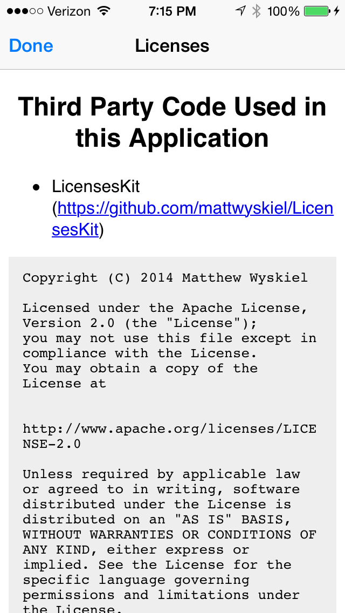

# LicensesKit
### Making giving credit where credit is due much easier than before.

If you've ever worked on an app that uses any third-party libraries (which is everyone), then you probably know that it's courteous (and sometimes mandatory, depending on the library) to add the library's license to an "acknowledgements" page in your app. And those pages are often tedious to put together and, especially, update. With LicensesKit, your troubles are over!

### LicensesKit is Flexible.
A lot of the popular license-displaying libraries (namely [VTAcknowledgementsViewController](https://github.com/vtourraine/VTAcknowledgementsViewController) and [TRZSlideLicenseViewController](https://github.com/86/TRZSlideLicenseViewController)) only have support for if all of your libraries are in CocoaPods. While the automation of aggregating all the licenses is nice, it doesn't help if, say, you use [Google's API client](https://code.google.com/p/google-api-objectivec-client/), which if don't want an [outdated pod](https://github.com/CocoaPods/Specs/blob/master/Specs/Google-API-Client/0.1.1/Google-API-Client.podspec.json), you would just use the SVN from the project site.

With LicensesKit you can just aggregate basic information about the libraries you use in a JSON file that you include in your app bundle (learn more about specifics below), or add them in code if you prefer. This abstracts and simplifies things for you as the developer because you do not need to worry about where the library is coming from, all you need is to just list it.

## LicensesKit in action


## Installation
Use CocoaPods (0.36+):

```ruby
pod 'LicensesKit'
```

## Usage
Basic usage of this library involves creating a `LicensesViewController` object, adding the libraries included in your app, and pushing the view controller onscreen.
### Adding 'Notices'
A **notice** is an object containing information about the library being used and its license. Namely:

 Property | Description | Example
 -------- | ----------- | -------
 name | The name of the library | `"AFNetworking"`
 url | The url where the library can be found | `"https://github.com/AFNetworking/AFNetworking"`
 copyright | The copyright information for the library (usually found paired with the license) | `"Copyright (c) 2013-2014 AFNetworking (http://afnetworking.com/)"`
 license | The license the library uses | `MITLicense()`

 As you can tell from above the `license` is a property of type `License`, of which this library includes many subclasses for most of the common licenses, adding more often, including:

 - Apache Software License 2.0
 - BSD 3-Clause License
 - Creative Commons Attribution-NoDerivs 3.0 Unported
 - GNU General Public License 2.0
 - GNU General Public License 3.0
 - GNU Lesser General Public License 2.1
 - ISC License
 - MIT License
 - Mozilla Public License, Version 2.0

 Of course, you can use the `CustomLicense` class to build your own license if it is not listed above (for example, if a library has their own custom license).

### Add notices from JSON
To automate the process of aggregating the licenses together for all the libraries used in your app, you can list all of your libraries and their licenses in a json file included in your app bundle, with a format as such:

``` json
{
    "notices": [
        {
            "name": "LicensesKit",
            "url": "https://github.com/mattwyskiel/LicensesKit",
            "copyright": "Copyright (C) 2014 Matthew Wyskiel",
            "license": "Apache Software License 2.0"
        },
        {
            "name": "StringBuilder",
            "url": "https://github.com/mattwyskiel/StringBuilder",
            "copyright": "Copyright (C) 2014 Matthew Wyskiel",
            "license": "Apache Software License 2.0"
        }
    ]
}
```

The `license` field's value directly correlates to the **name** of a license defined either in the library or a custom license you define. In order for the library to be able to use a license you define yourself (either by subclassing `License` or making a `CustomLicense` instance), you need to *register* the license with the LicensesViewController instance's **licensesResolver** object, like so:

**Swift**
```swift
licensesVC.resolver.registerLicense(customLicense)
```
**Objective-C**
```objective-c
[licensesVC.resolver registerLicense:customLicense];
```

As soon as you have your JSON file together and registered all the custom licenses you need, just use the `setNoticesFromJSONFile(filepath:)` method on your LicenseViewController instance:

**Swift**
```swift
licensesVC.setNoticesFromJSONFile(filepathForJSONFile)
```
**Objective-C**
```objective-c
[licensesVC setNoticesFromJSONFile:filepathForJSONFile];
```
*NOTE: If you add notices from JSON, this overrides all the notices currently set in the `LicensesViewController` instance. If you want to add notices from code (as described below), do so after any calls to `setNoticesFromJSONFile(filepath:)`.*

### Adding Notices in Code
To add a notice in code, just make a `Notice` instance and then call `addNotice(notice:)` (or `addNotices(notices:` if you want to add an array of notices at once).

**Swift**
```swift
let notice = Notice(name: "AFNetworking", url: "https://github.com/AFNetworking/AFNetworking", copyright: "Copyright (c) 2013-2014 AFNetworking (http://afnetworking.com/)", license: MITLicense())
licensesVC.addNotice(notice)
```
**Objective-C**
```objective-c
Notice *notice = [[Notice alloc] initWithName:@"AFNetworking" url:@"https://github.com/AFNetworking/AFNetworking" copyright:@"Copyright (c) 2013-2014 AFNetworking (http://afnetworking.com/)" license: [[MITLicense alloc] init]];
[licensesVC addNotice:notice];
```

## Customization
Of course, you can optionally customize what the licenses look like when they are displayed in the `LicensesViewController` instance.
- Set the `cssStyle` property to a string of CSS code to override the style of the content shown in the `LicensesViewController`.
- Set the `pageHeader` property to a string of HTML code to add content above the first license displayed.
- Set the `pageFooter` property to a string of HTML code to add content below the last license displayed.

## Documentation
All public API in this library is documented inline (just quick-look any item for more info). Because of this, documentation is also available on [CocoaDocs](http://cocoadocs.org/docsets/LicensesKit/1.0.0/index.html).

## That's it!
It's that simple! I hope you get much use out of this library as well as enjoy using it.

Please, if you find bugs, tell me about them in the Issues or submit pull requests yourself. That would help a ton!

## License
LicensesKit is licensed under the Apache Software License 2.0. See the LICENSE file for more details
